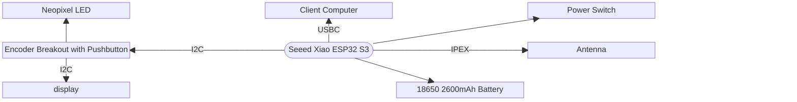
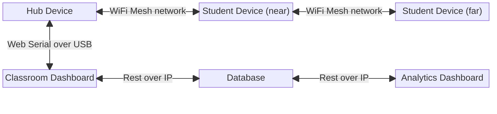

// class diagram

<!-- ```mermaid
classDiagram
    class Test {
        +string uuid
        +string name
        +Class class
    }
    class Class {
        +string uuid
        +string name
    }
    class Question {
        +string uuid
        +string text
        +List<Option>
        open()
        close()
        submitResponse(option, user)
    }
    class Option {
        +string text
        +bool correct
    }
    class User {
        +string uuid
        +string name
        +bool teacher
    }
    class Device {
        +string uuid
        +bool connected
        read()
        write(message)
        connect()
        disconnect()
    }
    Class "1" *-- "*" User
    User "1" -- "1" Device
    Test "1" *-- "*" Question
    Test "1" *-- "1" Class
    Question "1" o-- "1..*" Option
``` -->


