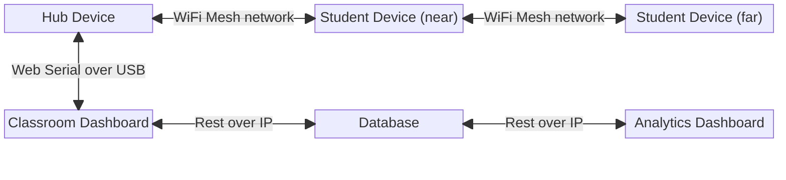
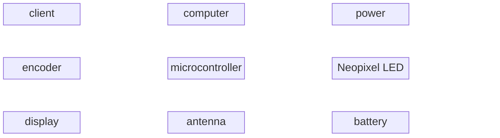

    microcontroller --"1 GPIO"--> slideSwitch1
    microcontroller --"1 GPIO"--> slideSwitch2
    encoder --"I2C"--> neopixelLED
    microcontroller --"I2C"--> encoder
    microcontroller --"I2C"--> display
    microcontroller --"IPEX"--> antenna
    microcontroller --"USBC"--> computer
    microcontroller --> battery